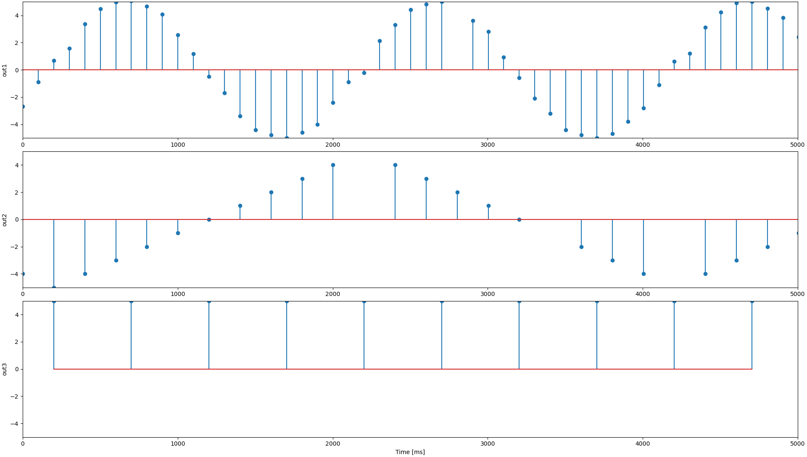
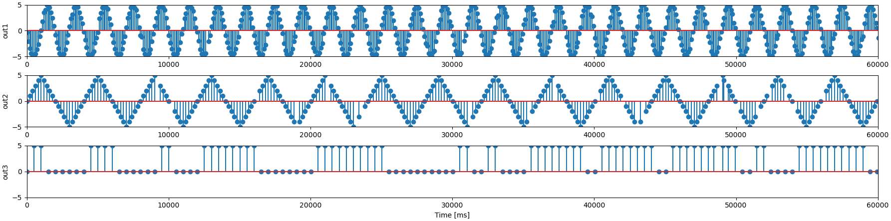

# Spooky Signal

## Description

Some utilities for processing the spooky signals.

## Design decisions

### io_uring

## Analysis

### Output at First Glance

I made a simple python script to capture the output of `client1`. It can be found under `analysis/plot_data.py`. It uses
`matplotlib` to plot the data. The script just generates stem plots of the data. Here is 5 seconds of data on all 3 channels:

This plot shows that `out1` is a 1/2 Hz sine wave with an amplitude of 5.0. `out2` is a 1/4 Hz triangle wave with an amplitude that is also 5.0. `out1` and `out2`.

`out3` appears to be a square wave of some sort, on a longer time scale it seems like there is some kind of digital information imprinted on it:

